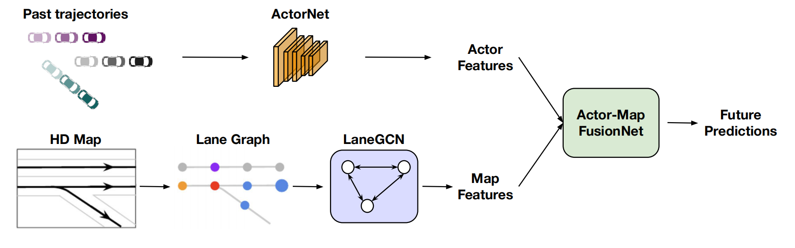
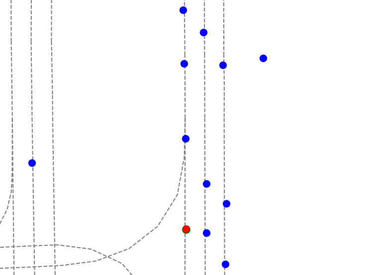
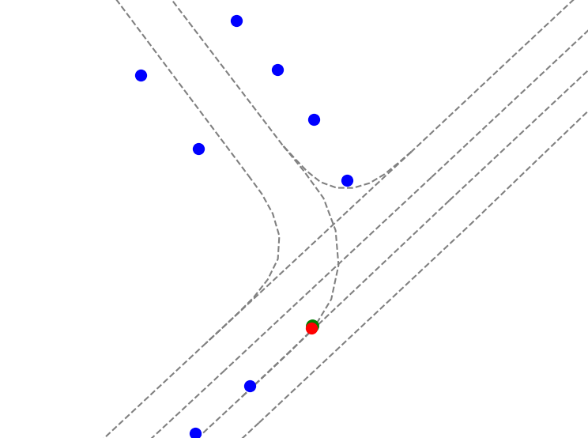
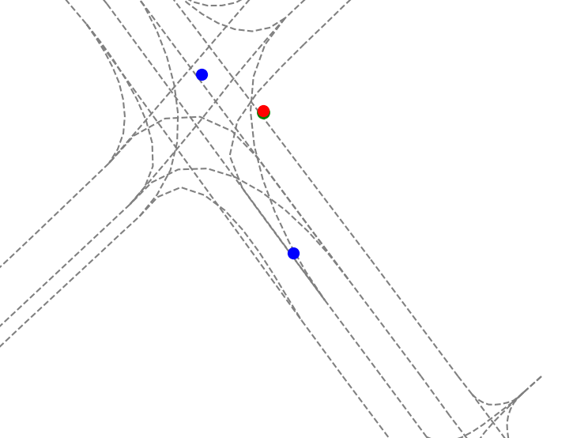
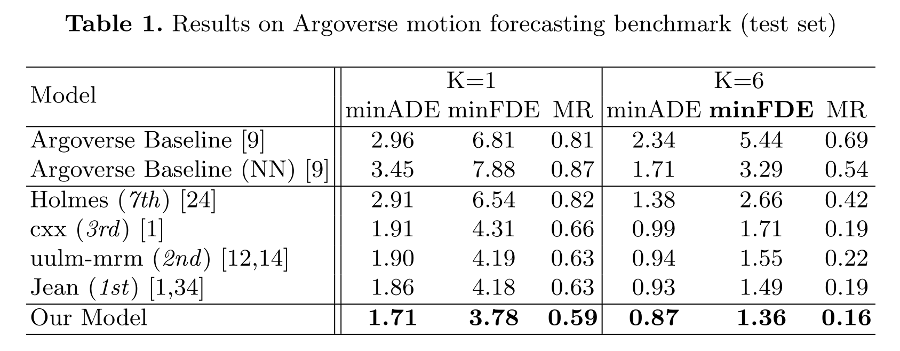

# LaneGCN: Learning Lane Graph Representations for Motion Forecasting


 [Paper](https://arxiv.org/pdf/2007.13732) | [Slides](http://www.cs.toronto.edu/~byang/slides/LaneGCN.pdf)  | [Project Page]() | [**ECCV 2020 Oral** Video]()

Ming Liang, Bin Yang, Rui Hu, Yun Chen, Renjie Liao, Song Feng, Raquel Urtasun


**Rank 1st** in [Argoverse Motion Forecasting Competition](https://evalai.cloudcv.org/web/challenges/challenge-page/454/leaderboard/1279)





## Install Dependancy
You need to install following packages in order to run the code:
- [PyTorch>=1.3.1](https://pytorch.org/)
- [Argoverse API](https://github.com/argoai/argoverse-api#installation)


1. Following is an example of create environment **from scratch** with anaconda:
```sh
conda create --name lgn python=3.7
conda activate lgn
conda install pytorch torchvision cudatoolkit=10.2 -c pytorch # pytorch=1.5.1 when the code is release

# install argoverse api
pip install  git+https://github.com/argoai/argoverse-api.git

# install others dependancy
pip install scikit-image IPython tqdm ipdb
```

2. \[Optional but Recommended\] Install [Horovod](https://github.com/horovod/horovod#install)  for distributed training. Horovod is more efficient than `nn.DataParallel` for mulit-gpu training and easier to use than `nn.DistributedDataParallel`. Before install horovod, make sure you have openmpi installed (`sudo apt-get install -y openmpi-bin`).
```sh
# install horovod with GPU support, this may take a while
HOROVOD_GPU_OPERATIONS=NCCL pip install horovod
pip install mpi4py
```
if you have any issues regarding horovod, please refer to [horovod github](https://github.com/horovod/horovod)

## Prepare Data: Argoverse Motion Forecasting
```sh
mkdir dataset && cd dataset

# step1: download Argoverse HD Maps
wget https://s3.amazonaws.com/argoai-argoverse/hd_maps.tar.gz
tar xf hd_maps.tar.gz
# copy map to argoverseapi root folder
PY_SITE_PACKAGE_PATH=$(python -c 'import site; print(site.getsitepackages()[0])')
echo "copying map files to python3.7/site-packages: ", $PY_SITE_PACKAGE_PATH
cp -r map_files $PY_SITE_PACKAGE_PATH

# step2: download Argoverse Motion Forecasting **v1.1** 
# train + val + test
wget https://s3.amazonaws.com/argoai-argoverse/forecasting_train_v1.1.tar.gz
wget https://s3.amazonaws.com/argoai-argoverse/forecasting_val_v1.1.tar.gz
wget https://s3.amazonaws.com/argoai-argoverse/forecasting_test_v1.1.tar.gz
tar xvf forecasting_train_v1.1.tar.gz
tar xvf forecasting_val_v1.1.tar.gz
tar xvf forecasting_test_v1.1.tar.gz

# step3: [Optional but HIGHLY RECOMMENDED] preprocess data to accelerate training
python preprocess_data.py -m lgn
```

## Training

### [Recommended] Training with Horovod

```sh
# single node with 4 gpus
horovodrun -np 4 -H localhost:4 python /path/to/train.py -m angle90

# 2 nodes, each with 4 gpus
horovodrun -np 8 -H serverA:4,serverB:4 python /path/to/train.py -m angle90
``` 

It takes 11 hours to train the model in 4 GPUS (RTX 5000) with horovod.

### [Recommended] Training/Debug with Horovod in single gpu 
```sh
python train.py -m lgn
```

### Training/Debug with Single GPU
```
python train.py
```

## Testing
### Inference test set for submission
```
python test.py -m lgn --weight=46.000.ckpt --split=test
```
### Inference validation set for metrics
```
python test.py -m lgn --weight=46.000.ckpt --split=val
```

**Qualitative results**
\[<span style="color:#A52A2A"><b>Labels  </b> </span>   <span style="color:#228B22"><b>  Prediction </span></b>   <span style="color:#1E90FF"><b>   Other agents</b></span>\]

<center class="half">



</center>


**Quantitative results**


## Licence
check [LICENSE](LICENSE)

## Citation
If you use our source code, please consider citing the following:
```
@InProceedings{liang2020learning,
  title={Learning lane graph representations for motion forecasting},
  author={Liang, Ming and Yang, Bin and Hu, Rui and Chen, Yun and Liao, Renjie and Feng, Song and Urtasun, Raquel},
  booktitle = {ECCV},
  year={2020}
}
```